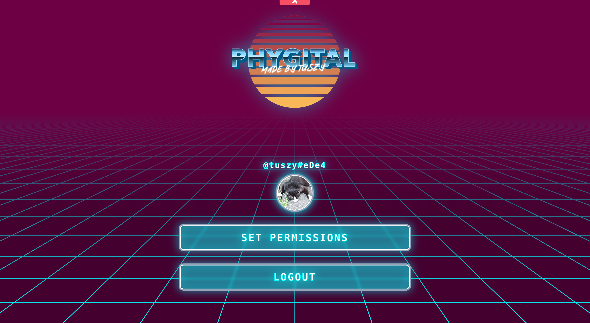
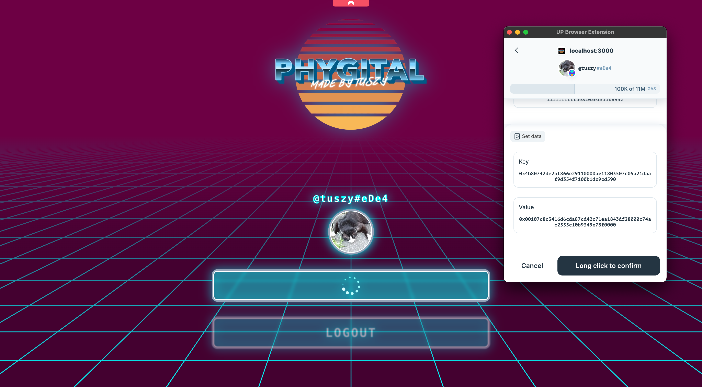

# Phygital Frontend

Web frontend is used for adding a controller with specific permissions to the key manager of the universal profile allowing better ux within the [phygital app](https://github.com/Tuszy/phygital-app). Furthermore it is using [**Log-In With UP**](https://docs.lukso.tech/learn/dapp-developer/siwe/) to send a signature to the [Backend](https://github.com/Tuszy/phygital-backend) which in exchange sends a [JWT](https://jwt.io/) (valid for 24 hours) to create an **App Login QR Code**.

# Deployment
1. Testnet: https://phygital.tuszy.com

# Remarks
Only supports the [Universal Profile Extension](https://docs.lukso.tech/guides/browser-extension/install-browser-extension/) - no Metamask or any other Web3 wallet. For this reason, you cannot use a mobile phone at the time of writing, you must have a computer to log in with your Universal Profile and set the required permissions and create the **App Login QR Code**.

## App Login QR Code
Allows the user to login into the app intuitively by scanning a QR code which contains all the necessary authentication data.
#### Format:
```
ethereum:<up_address>@<chain_id>:<jwt>
```

# Simple Workflow

1. Login with Universal Profile
   
   
   
2. Set Permissions
   
   
   
3. Create **App Login QR Code**
   
   
4. Scan **App Login QR Code** with [Phygital app](https://github.com/Tuszy/phygital-app)
5. Done

# Set Permissions

Controller: 0xAc11803507C05A21daAF9D354F7100B1dC9CD590

1. [AddressPermissions:Permissions](https://github.com/lukso-network/LIPs/blob/main/LSPs/LSP-6-KeyManager.md#addresspermissionspermissionsaddress)
   1. call
   2. relay call
   3. set data
2. [AddressPermissions:AllowedCalls](https://github.com/lukso-network/LIPs/blob/main/LSPs/LSP-6-KeyManager.md#addresspermissionsallowedcallsaddress)
   1. restrictionOperations: call
   2. allowedAddress: all contract addresses (0xffffffffffffffffffffffffffffffffffffffff)
   3. allowedInterfaceId: Interface id of [PhygitalAsset contract](https://github.com/Tuszy/phygital-smart-contract/blob/main/contracts/PhygitalAsset.sol) (see [_INTERFACEID_PHYGITAL_ASSET](https://github.com/Tuszy/phygital-smart-contract/blob/main/contracts/PhygitalAssetConstants.sol))
   4. allowedFunction: selectors of
      1. function **mint**(address phygitalAddress, uint phygitalIndex, bytes memory phygitalSignature, bytes32[] memory merkleProofOfCollection, bool force)
      2. function **verifyOwnershipAfterTransfer**(address phygitalAddress, bytes memory phygitalSignature)
      3. function **transfer**(address from, address to, bytes32 tokenId, bool force, bytes memory data)
3. [AddressPermissions:AllowedERC725YDataKeys](https://github.com/lukso-network/LIPs/blob/main/LSPs/LSP-6-KeyManager.md#addresspermissionsallowederc725ydatakeysaddress)
   1. **LSP12IssuedAssets[]** - ERC725Y Key Prefix: 0x7c8c3416d6cda87cd42c71ea1843df28
   2. **LSP12IssuedAssetsMap** - ERC725Y Key Prefix: 0x74ac2555c10b9349e78f0000 